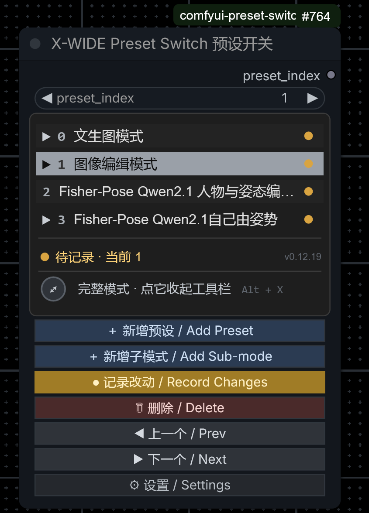

# X-WIDE Preset Switch Plus

**Save your entire workflow state as a handful of presets, then switch between them in one click** — node **bypass / mode** and **widget values** all switch together.

Every piece of state a node holds is captured, for example: **model swaps, numeric values, image imports, booleans, names** and more.

It supports **sub-modes** (several sub-states hanging under one mode), a **missing-node red dot**,
**compact mode**, and a **keyboard shortcut to collapse/expand the panel**.

> This is an enhanced version (GPL-3.0) of [CarlMarkswx/comfyui_workflow_preset_switch](https://github.com/CarlMarkswx/comfyui_workflow_preset_switch), maintained by **X-WIDE**.
> The original only records a node's bypass / mode state; **this fork also records and restores node widget parameter values**.

Type **`xwide`** / **`x-wide`** / **`X-WIED`** / **`预设`** / **`子模式`** into the node search box and the node comes up directly (search aliases are configured).

## 🌐 Language / Language

- [简体中文 README](README.md)
- **English README** (this page)

<p align="center">
  
  <br>
  <sub>Node panel: preset list · red dot for missing nodes · full/compact mode · action buttons · shortcut</sub>
</p>

---

## The Problem It Solves

When a workflow has several states to it (say "text to image / image to image / image editing"), every switch means hand-editing a bunch of places:

- one switch has to go to `1` or `2`
- another switch has to go to `true` or `false`
- a few more nodes have to be turned on or off

**Miss one and you get a wrong result, and it's hard to spot.** This plugin lets you save those combinations as presets, and afterwards it's a single click.

```
        ┌─────────────────────────────────────────┐
        │  X-WIDE Preset Switch                   │
        │  ┌───────────────────────────────────┐  │
        │  │ ▼ 0  Image gen mode              │  │ ← click this row to switch
        │  │   └ 0-1 Official prompt opt on   │  │ ← sub-mode, only covers the deltas
        │  │   └ 0-2 Official prompt opt off   │  │
        │  │   1  Image edit mode          ●  │  │ ← red dot = a node was deleted
        │  ├───────────────────────────────────┤  │
        │  │ Now 0-1 · …           [Compact]   │  │
        │  │                                   │  │
        │  │ [＋Preset][＋Sub-mode] [●Record][🗑Del] [◀][▶] │
        │  └───────────────────────────────────┘  │
        └─────────────────────────────────────────┘
             switch states + parameter values together
```

---

## Compared with the Original

| Feature | Original | This version v0.12.20 |
|---|:---:|:---:|
| Record/restore node bypass, mode | ✅ | ✅ |
| Record/restore widget parameter values | ❌ | ✅ |
| Sub-modes (several sub-states under one mode) | ❌ | ✅ |
| Missing-node red dot + one-click ignore | ❌ | ✅ |
| Compact mode (hide the action buttons) | ❌ | ✅ |
| **Shortcut to collapse/expand + customizable + conflict warnings** | ❌ | ✅ |
| Node search aliases (find it by searching X-WIDE) | ❌ | ✅ |
| Preset browser / rename / add & delete | ✅ | ✅ |
| Three-state group panel (Group Editor) | ✅ | ✅ |
| Node type name | `PresetSwitch` | Same name, **drop-in migration** |

---

## Installation

### Option 1: ComfyUI Manager (recommended)

Manager → **Install via Git URL** → paste this repository's address:

```
https://github.com/XWIDE/comfyui-preset-switch-plus
```

### Option 2: Manual

```bash
cd ComfyUI/custom_nodes
git clone https://github.com/XWIDE/comfyui-preset-switch-plus.git
```

**No dependencies, nothing to install with pip.** Restart ComfyUI when you're done.

> ⚠️ **Do not install this alongside the original `comfyui_workflow_preset_switch` / `comfyui_workflow_state_presets`**:
> they register the same node type name, so they collide. Delete the original folder before installing this one.

---

## Usage

### 1. Add the node

Double-click an empty spot on the canvas → search **`xwide`** or **`预设`** or **`Preset Switch`**
(category: `X-WIDE/Preset`, display name `X-WIDE Preset Switch 预设开关`).

### 2. Save the first state

1. **Arrange the workflow into the first state** (turn on what should be on, set the parameters you need)
2. Set `preset_index` to **`0`**
3. Click **`● Record current`**
4. **Double-click that row in the list** → type a name, e.g. `Image gen mode`

### 3. Save the second state

1. **Arrange the workflow into the second state**
2. Click **`＋ Preset`** (this creates `1` and switches to it automatically)
3. Click **`● Record current`**, then double-click to rename it, e.g. `Image edit mode`

> Repeat this as many times as you need states, with the index going up each time.

### 4. Switching

- **Click a row in the list** → the whole state is applied immediately
- Or change the `preset_index` number — same effect
- `◀` / `▶` step through in the order "parent mode → its sub-modes → next parent mode"

---

## Sub-modes (added in 0.3.0)

If you want to split one big mode into a few smaller states, use sub-modes. Typical scenario:

> Under **Image gen mode** you want "Official prompt opt on / off"; same under **Image edit mode**.
> Only one or two nodes differ, and you'd rather not build a whole separate top-level mode for every combination.

### How to create them

1. First set up the **parent mode** and click `● Record current` (e.g. `0 Image gen mode`)
2. With the parent mode active, **change only what you want to differ** (for example, set the "Official prompt opt" node to bypass)
3. Click **`＋ Sub-mode`** → `0.1` is created automatically and the current state is recorded
4. Change things again (a different combination) and click `＋ Sub-mode` again → `0.2` is created
5. Double-click a row to rename it, e.g. `0-1 Official prompt opt on` / `0-2 Official prompt opt off`

### How it works

When you click a sub-mode, the plugin **restores the parent mode's state first, then layers on the differences recorded by that sub-mode**.
So a sub-mode is an "incremental override on top of the parent", and you never have to store the whole state twice.

### Panel interactions

| Action | Effect |
|---|---|
| Click the **text of a parent mode row** | Switch to that mode and expand its sub-modes |
| Click the **text of a sub-mode row** | Restore the parent mode first, then layer the sub-mode's differences |
| Click the **▶ / ▼ triangle** on the left | Only expand or collapse — **it does not change the currently active mode** (guards against misclicks) |
| Double-click any row | Rename that preset |
| Drag rows up and down | Reorder within the same level (parent modes swap with parent modes, sub-modes with their siblings under the same parent) |

---

## Missing-node red dot (added in 0.3.0)

When a preset is recorded, the plugin remembers which node each snapshot row came from. If you later **delete one of those nodes**,
that preset is no longer complete — the plugin tells you instead of silently skipping it.

### What it looks like

1. When you apply (or switch to) that preset, the plugin detects that a recorded node is no longer on the canvas
2. A **red dot appears at the end of that row**; if several are missing, the count is shown next to the dot
3. **Hover the red dot** → a tooltip says "N nodes missing: NodeTypeA, NodeTypeB…"
4. **Click the red dot** → a popup lists the missing nodes' **types and IDs**, where you can:
   - **Copy the list** — take it to the canvas and add the missing nodes back
   - **Ignore this record (remove the red dot)** — confirm those nodes are no longer needed, and they are stripped
     from that preset's record; the red dot disappears and you won't be warned again

> If you **click `● Record current` again**, the warning state resets automatically (the new record already contains the nodes that really exist now).

---

## Compact mode (added in 0.3.0)

Once all your presets are dialled in, the whole toolbar (`＋Preset` / `＋Sub-mode` / `●Record` / `🗑Delete` / `◀` / `▶`)
isn't needed most of the time.

**Click the "Compact mode" toggle on the right of the panel** and the toolbar hides as a whole, leaving only the preset list — the interface is clean instantly.
Click it again to bring the toolbar back. The toggle state is **saved together with the workflow**.

---

## A Real Example: One Switch for "Text to Image / Image to Image"

Say you have two text encoders and two sets of prompts, each corresponding to one mode:

**When saving `0 Text to image`**: `CLIP` switch = t2i, prompt switch = `true`
**When saving `1 Image to image`**: `CLIP` switch = i2i, prompt switch = `false`

After that, **click a row in the list and both switches flip together** — no more editing two places by hand.

Together with `Preset Group Editor` you can also switch which modules run (for example a camera-rotation module that should only load for image to image).

---

## Button Reference

The toolbar is grouped by purpose, with a gap between the groups:

| Group | Button | What it does |
|---|---|---|
| **Add** | `＋ Preset` | Create a new top-level preset and switch to it |
| | `＋ Sub-mode` | Create a sub-mode under the **current mode** and record the current state |
| **Record** | `● Record current` | Overwrite the **current state** into the currently active preset (the one you'll use most, highlighted in amber) |
| | `🗑 Delete` | Delete the current preset (deleting a parent mode deletes its sub-modes too) |
| **Navigate** | `◀` / `▶` | Step through in the order "parent mode → its sub-modes → next parent mode" |

> Hovering any button shows its full description. Changing the `preset_index` number, or clicking a row in the list,
> switches presets just as well — which is why `◀` / `▶` only take up the space of two little arrows.

| Other | What it does |
|---|---|
| Preset list | **Click a row to switch**, double-click to rename, drag up/down to reorder within a level |
| `▶` / `▼` on the left | Only expand / collapse sub-modes, **without changing** the currently active mode |
| Red dot at the end of a row | That preset's recorded nodes are no longer on the canvas — hover for a summary, click for details |
| Compact mode toggle | Hides the whole toolbar, leaving only the preset list (state is saved with the workflow) |
| **X-WIDE badge** | Click to open the author's page (Bilibili) |
| `⚙ Settings` | Shortcut, signature, overlay zoom range |

---

## Signature Badge

There's a small white badge on the left of the panel header showing the **X-WIDE logo**; click it to open the author's page:

**https://space.bilibili.com/374064919**

> The number in it is the Bilibili account **UID, which never changes** (renaming the account doesn't affect it), so this address stays valid long term.
> The `?spm_id_from=…` in the original share link is just a traffic-source tracking parameter, and it has been removed.

In `⚙ Settings` you can change three things:

| Setting | Description |
|---|---|
| Signature text | Shown when there is no logo image |
| Target URL | Where the badge points; **only http/https is allowed** (`javascript:` is rejected) |
| Logo image | A path relative to the plugin (e.g. `./logo_xwide.png`) or a full URL; **leave it empty to fall back to a text badge** |

Two pre-cropped logos ship with the plugin — fill whichever you need into the settings:

| File | Size | Best for |
|---|---|---|
| `web/logo_xwide.png` | 600×300 (2:1) | The default: X mark + X-WIDE wordmark |
| `web/logo_xwide_icon.png` | 128×128 (1:1) | Pick this one if you want something smaller, with just the X mark |

---

## Keyboard Shortcut (added in 0.5.0)

Default is **<kbd>Alt</kbd> + <kbd>X</kbd>**: press it anywhere on the ComfyUI page to **enter compact mode**
(collapsing the whole toolbar, leaving only the preset list), and press it again to exit. It won't steal keys while you're typing in an input field.

In `⚙ Settings` you can change the shortcut's action to **"collapse / expand the whole panel"** (the node keeps only its title bar),
which suits situations where you need the canvas completely free.

### Changing it to a key you like

Click **`⚙ Settings`** at the far right of the toolbar → click the shortcut input → **just press the combination you want**.
The settings dialog immediately tells you whether that combination is usable:

| Indicator | Meaning | Examples |
|---|---|---|
| ✕ Reserved by system/browser | The key never even reaches the page, **unusable** | <kbd>Alt</kbd>+<kbd>Space</kbd>, <kbd>F5</kbd>, <kbd>Ctrl</kbd>+<kbd>W</kbd> |
| ✕ Conflicts with ComfyUI | ComfyUI will swallow it, **unusable** | <kbd>Ctrl</kbd>+<kbd>Enter</kbd>, <kbd>Ctrl</kbd>+<kbd>S</kbd> |
| ! Easy to hit by accident | It registers, but at a cost | <kbd>Delete</kbd>, space, no modifier key |
| ✓ Available | No conflict found | <kbd>Alt</kbd>+<kbd>X</kbd>, <kbd>Alt</kbd>+<kbd>J</kbd> |

You can also click "Clear shortcut" to turn it off entirely (the panel is still operable from the node), or "Restore default".

> ⚠️ The shortcut only works **inside the ComfyUI page**. To summon the panel from Photoshop, a browser address bar, or
> **any other program**, you'd need a separate OS-level global hotkey tool — that's outside the scope of this plugin.

### Overlay zoom range

The toolbar, red dots and toggles follow the canvas zoom, but are clamped between a lower and upper bound (default `0.8 ~ 1.4`),
so that when you zoom far in, the buttons don't turn into giant blocks covering the panel, and when you zoom far out they're still clickable.

The setting lives in browser `localStorage` and is **shared by all workflows**; preset contents still travel with their own workflow.

---

## Help Document (Chinese + English)

Settings window → **`📖 打开帮助文档`** opens the full manual in its own window: every feature
explained, a keyboard-shortcut reference, the complete story on excluding nodes from recording,
missing-node red dots, troubleshooting, and where your data lives.

The manual ships in two versions — **Chinese** and **English** (`web/help.html` / `web/help.en.html`).
The language line at the top of the page switches between them (**no JavaScript required** — it's
just a link, so it works inside the dialog and in a new tab alike). Your choice is remembered in
browser `localStorage`, so the next open lands on the version you picked, and the dialog's
"open in a new tab" link follows along instead of pointing at the other language.

---

## Options (optional)

Adjustable via node right-click → `Properties`, or in the workflow metadata:

| Option | Default | Description |
|---|---|---|
| `onUntrackedNode` | `bypass` | What to do with a **new node** that isn't in the preset: `bypass` to skip it / `enable` to enable it / `preserve` to leave it alone |
| `onMissingNode` | `skip` | Behaviour when a node in the preset has been deleted (the red dot is unaffected by this option and always warns) |
| `indexOutOfRange` | `warn` | When `preset_index` points at a preset that doesn't exist |
| `hideCrudButtons` | `false` | Whether compact mode is on (controlled by the toggle at the top right of the panel) |

> 💡 If you add a node and find "it turned purple by itself (bypassed)", this is `onUntrackedNode` at work.
> Either `Record` it into every preset, or change the option to `preserve`.

### Debugging helper

The toolbar, red dots, compact-mode toggle and signature badge are all HTML elements floating over the canvas.
If they display incorrectly, open the browser console (F12) and run:

```js
__wpsOverlay.info()      // print anchor point, zoom, rejected measurements, button coordinates
__wpsOverlay.lastReject  // the last control measurement deemed untrustworthy
```

The current version number (e.g. `v0.12.20`) is shown on the right of the panel header and next to the settings dialog title,
so you can confirm which build the browser is running.

---

## Notes

- **Presets are stored inside the workflow file** (`workflow.graph.extra`), so they travel with the workflow and are included when you share it.
- **After upgrading from 0.1.0, record again**: presets saved by the old version contain no widget data.
  Upgrading from 0.2.0 onwards does **not** require re-recording; old records are automatically backfilled with the information the missing-node detection needs.
- **Sub-modes are only one level deep**: you cannot hang `0.1.1` under `0.1`. If you need a finer split, open another top-level mode.
- **If a parameter value is taken over by an input port, restoring it won't take effect**: once a widget is occupied by a link,
  the effective value comes from the upstream node and the value in the preset is overridden. In that case, put the presets on the upstream node instead.
- "Unused branches still execute" is ComfyUI's own behaviour, not something this plugin does. To avoid the wasted run,
  use `Preset Group Editor` to set the unused modules to bypass (BYPASS).

---

## License

**GPL-3.0**, same as the original.

This repository is a modified version of [CarlMarkswx/comfyui_workflow_preset_switch](https://github.com/CarlMarkswx/comfyui_workflow_preset_switch) (author CarlMarkswx, GPL-3.0);
see [CHANGELOG.md](CHANGELOG.md) for the changes. Copyright for the original belongs to its original author.

---

## 中文

**X-WIDE Preset Switch Plus** —— 把整个工作流的状态存成几套预设，点一下整体切换（节点的 bypass / mode **加上** widget 参数值）。

相比原版，本版新增：

- **子模式** —— 一个顶层模式（`0`）下面可以挂多个子状态（`0.1`、`0.2`）。点一个子模式会先还原父模式，再把该子模式的差异叠上去，所以你只需要记录差异那部分。
- **缺失节点红点** —— 预设会记住它是从哪些节点记录来的。如果之后某个节点被删掉，那一行会显示一个红点：悬停看摘要，点击看完整的类型 / ID 列表，还可以一键「忘掉这条记录」把它消掉。
- **清爽模式** —— 面板上的一个开关可以隐藏整条操作工具栏，只留预设列表。这个设置会跟着工作流一起保存。
- **搜索别名** —— 在节点菜单里搜 `xwide`、`x-wide`、`X-WIED`、`preset` 或 `预设` 都能直接找到。

工具栏按用途分组：*新增*（`＋ 预设`、`＋ 子模式`）、*记录*（`● 记录当前` —— 高亮显示、`🗑 删除`）、*导航*（`◀` `▶`）。所有浮层控件都会随画布缩放。

安装：ComfyUI Manager → *Install via Git URL* → 填本仓库地址。**无任何依赖。**
节点类型名（`PresetSwitch`、`PresetGroupEditor`）没有改动，所以已有的工作流可以继续用。

用法：把画布摆成状态 A → `preset_index = 0` → `● 记录当前`；再摆成状态 B → `＋ 预设` → `● 记录当前`。之后点预设列表里的一行，整套状态就切过去了。

以 **GPL-3.0** 发布。本仓库是 [CarlMarkswx/comfyui_workflow_preset_switch](https://github.com/CarlMarkswx/comfyui_workflow_preset_switch) 的修改版；改动见 [CHANGELOG.md](CHANGELOG.md)。
